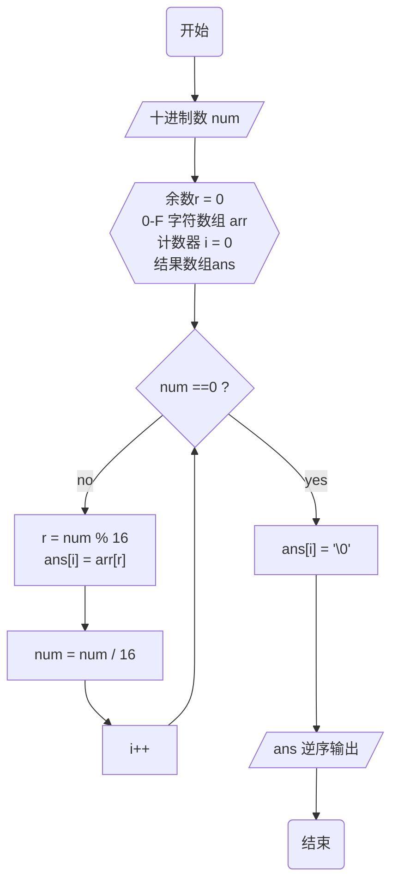
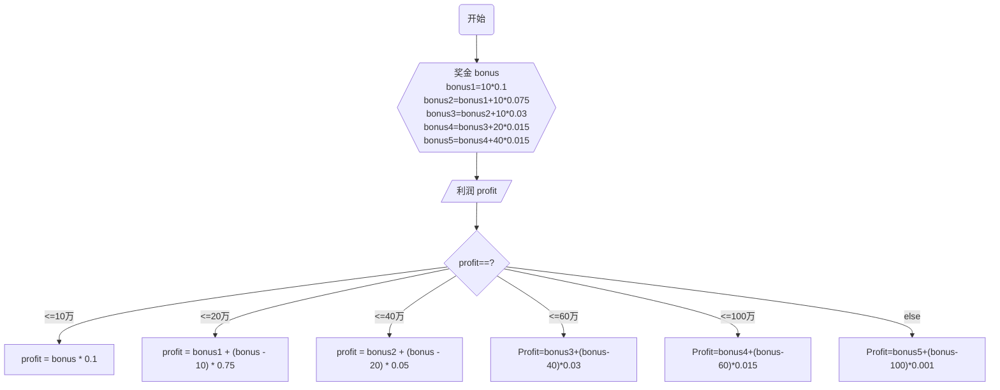

**1 十进制转十六进制**



**2 1234组成的无重复数字三位数**

```mermaid
flowchart TB
    A(开始)
    A --> B{{i=0,j=0,k=0,count = 0}}
    B --> B1[i==1]
    B1 --> C{i<5?} -- yes -->j=1-->D
    C -- no --->Y[/输出 count/]---> Z(结束)
    D{j<5?} -- yes -->k=1--> F1
    D -- no --> i++ --> C
    F1{k<5?} -- no --> j++ --> D
    F1 -- yes --> F2{"ijk\n互不相同?"}
    F2 --yes--> G["打印 i * 100 + j* 10 + k\ncount++"]
     H[k++] --> F1
    G --> H
```
**3利润计算**

