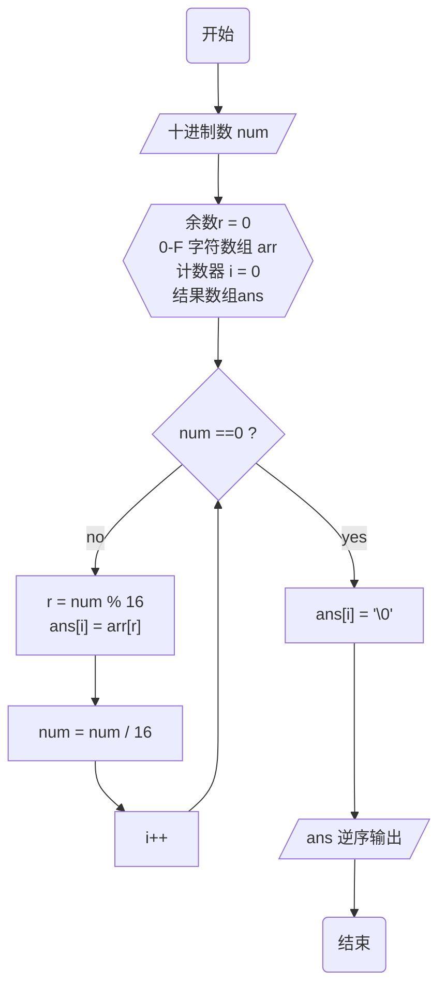

**1 十进制转十六进制**

```mermaid
flowchart TB
    A(开始) --> B[/十进制数 num/] --> C{{"余数r = 0\n0-F 字符数组 arr\n计数器 i = 0\n结果数组ans"}}
    C --> D{num ==0 ?} -- no --> E["r = num % 16\nans[i] = arr[r]"] --> F[num = num / 16] --> G[i++]
    G --> D -- yes --> H["ans[i] = '\0'"] ---> I[/ans 逆序输出/] --> J(结束)
```