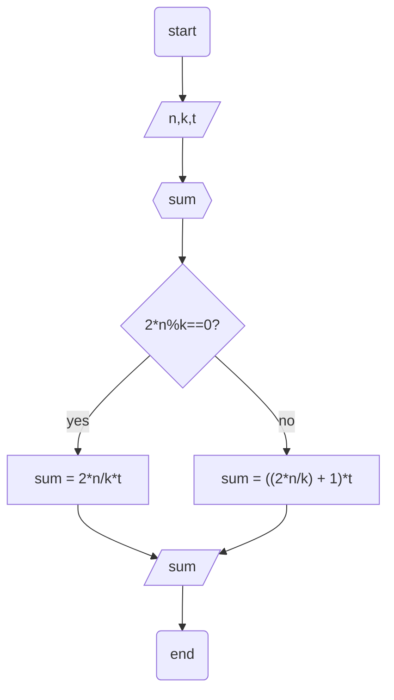
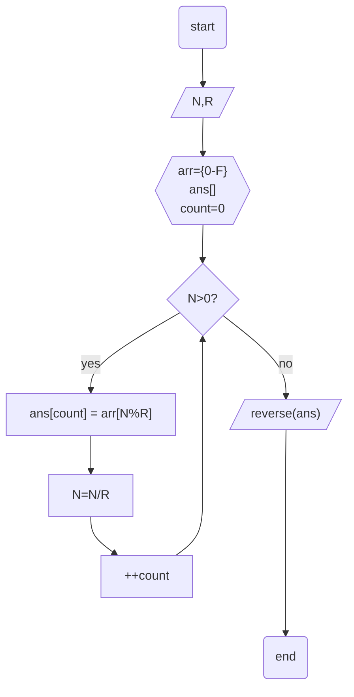
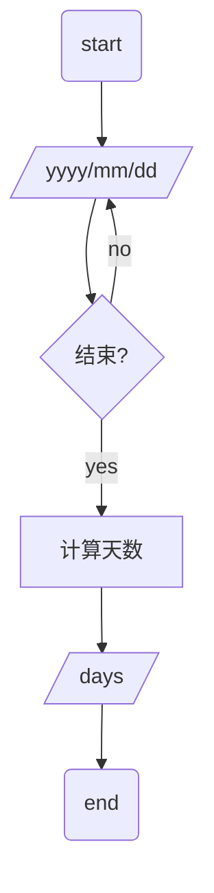
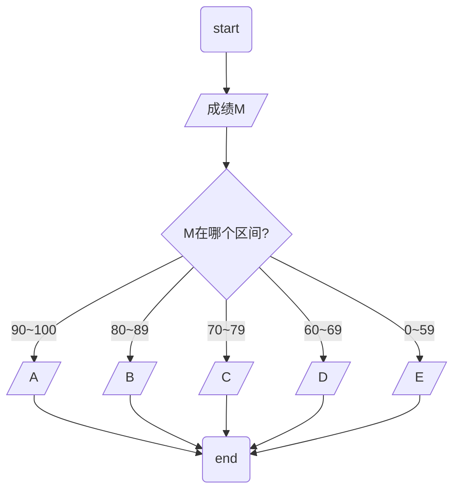
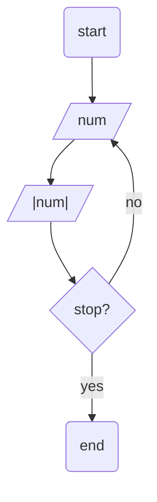
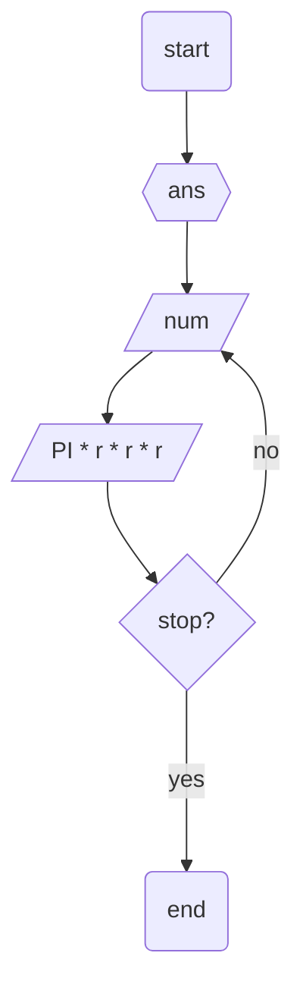

## 1 韩信点兵

相传韩信才智过人，从不直接清点自己军队的人数，只要让士兵先后以三人一排、五人一排、七人一排地变换队形，而他每次只掠一眼队伍的排尾就知道总人数了。输入3个非负整数a,b,c ，表示每种队形排尾的人数（a<3,b<5,c<7），输出总人数的最小值（或报告无解）。已知总人数不小于10，不超过100 。

**输入**

输入3个非负整数a,b,c ，表示每种队形排尾的人数（a<3,b<5,c<7）。例如,输入：2 4 5

**输出**

输出总人数的最小值（或报告无解，即输出No answer）。实例，输出：89

```mermaid
flowchart TB
  st(start)
  ed(end)
  input[/a,b,c/]
  init{{i = 10}}
  condition{i整除3和5和8?}
  output[/i/]
  cond2{i < 100?}

  st --> input --> init --> condition
  condition -- yes --> output
  condition -- no --> i++ --> cond2
  cond2 -- yes --> condition
  cond2 -- no --> i=-1 --> output --> ed
```

## 2 兰州烧饼

烧饼有两面，要做好一个兰州烧饼，要两面都弄热。当然，一次只能弄一个的话，效率就太低了。有这么一个大平底锅，一次可以同时放入k个兰州烧饼，一分钟能做好一面。而现在有n个兰州烧饼，至少需要多少分钟才能全部做好呢？

**输入**

依次输入 n 和 k，中间以空格分隔，其中 1 <= k, n <= 100000

**输出**

输出全部做好至少需要的分钟数

**提示**

如样例，三个兰州烧饼编号 a,b,c 首先 a 和 b，然后 b 和 c，最后 a 和 c 3 分钟完成。


## 3 进制转换

输入一个十进制数N，将它转换成R进制数输出。

**输入**

输入数据包含多个测试实例，每个测试实例包含两个整数N(32位整数)和R（2<=R<=16, R<>10）。

**输出**

为每个测试实例输出转换后的数，每个输出占一行。如果R大于10，则对应的数字规则参考16进制（比如，10用A表示，等等）。



## 4 给定一个日期，输出这个日期是该年的第几天。

**输入**

输入数据有多组，每组占一行，数据格式为YYYY/MM/DD组成，另外，可以向你确保所有的输入数据是合法的。

**输出**

对于每组输入数据，输出一行，表示该日期是该年的第几天。



## 5 成绩转换

输入一个百分制的成绩M，将其转换成对应的等级，具体转换规则如下：

```
90~100为A;
80~89为B;
70~79为C;
60~69为D;
0~59为E;
```


## 6 求实数的绝对值。

求实数的绝对值。

**输入**

输入数据有多组，每组占一行，每行包含一个实数。

**输出**

对于每组输入数据，输出它的绝对值，要求每组数据输出一行，结果保留两位小数。



## 7 计算球体积

根据输入的半径值，计算球的体积。

**输入**

输入数据有多组，每组占一行，每行包括一个实数，表示球的半径。

**输出**

输出对应的球的体积，对于每组输入数据，输出一行，计算结果保留三位小数。


